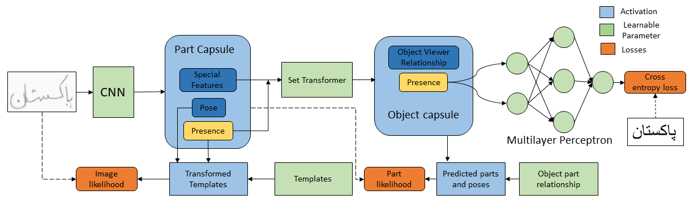
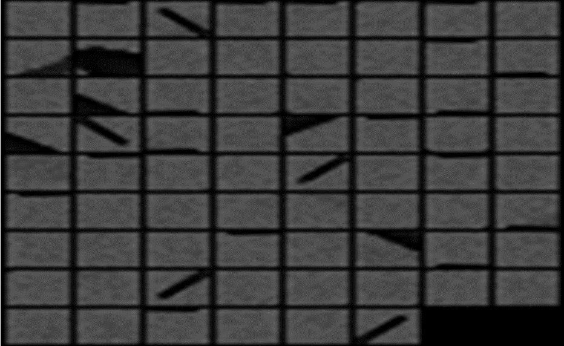

# G1A_Project_DLSpring2020

This repository contains code and results for Course Project by Deep Learning Spring 2020 course offered at Information Technology University, Lahore, Pakistan. This project is only for learning purposes and is not intended to be used for commercial purposes. Course Link: http://im.itu.edu.pk/deep-learning-spring-2020/

## Urdu Handwritten Keyword Recognition Using Capsule Networks

### Abstract

Existing handwritten keywork recognition models use CNN and RNN networks which require huge
amounts of representative training data and can’t generalize to different viewpoints. In
contrast, capsule networks model the geometric relationships between the different visual parts.
In this work, we utilize the stacked capsule autoencoder \[1\] architecture and train it in supervised
fashion by using multilayer perceptron and cross entropy loss.

### Dataset

For this work, a custom dataset was compiled and collected. We collected a dataset of 50 Urdu words with 20 images for each word resulting in
a total of 1000 samples. In order to ensure that variations in the collected words representative
of the real-world handwritten documents was captured, each of the 20 images for a particular word
were collected from different writers. Red ink was used to write the words. The motivation behind
this was to perform noise-removal pre-processing steps from the raw images. Data was collected
from 40 participants  with each participant having to write 25 words.

The dataset is available
[here](https://drive.google.com/drive/folders/1FjuAX7xHgNSsP1ZxF_EsJIxzdRHrZGDl?usp=sharing).

### Experiments

We have evaluated two techniques including both the existing techniques and our model.

1. CNN-RNN-CTC Model: The CRNN-CTC model, commonly used for OCR tasks, is evaluated with our
   dataset. Problem was defined as a sequence-modeling task in which the word characters were
   predicted.
   
2. SCAE-MLP: The stacked capsule autoencoder was trained in a supervised fashion with 
   the addition of a MLP and cross-entropy loss function at output of e prthe object encoder.
  
   

3. SCAE-Unsupervised: The stacked capsule autoencoder was trained on the unlabeled images. The learned
   object presence probabilities were then trained separately with a MLP.
 
### Results
Classification accuracies of all three methods are summarized below:

Method | Test Accuracy
-------|-------------
CNN-RNN-CTC|0.96
SCAE-MLP|43
SCAE-Unsup|35

Learned part templates from the SCAE-Unsupervised experiment:

### Trained Models
Pre-trained model weights are available [here](checkpoints).

### References

1. Kosiorek, A. R., Sabour, S., Teh, Y. W., & Hinton, G. E. (2019). 
Stacked Capsule Autoencoders. NeurIPS. 
http://arxiv.org/abs/1906.06818
